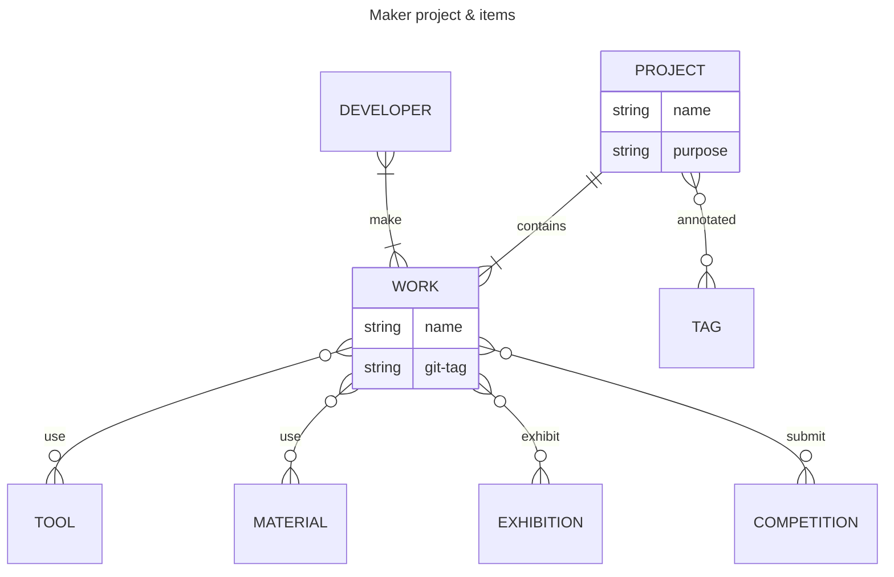

# BotaLab Profile Page (Template of Maker Page Generator)

[](https://github.com/botamochi6277/botalab/actions/workflows/pages.yml)

This is template to deploy a maker profile page

## Widgets

### ProtoPedia Works List

Prototype list in your ProtoPedia Works.
The list is created by `scripts/fetch_prototype.js`, which create `src/assets/prototypes.json`

### Exhibition Timeline

Exhibition Timeline created from `src/assets/exhibitions.json`

## Install

```console
git clone https://github.com/botamochi6277/botalab.git your_page
cd your_page
npm install
```

### dev run

```console
npm run dev
```

## Future Data structure

### items

- projects
- works
- developers
- materials
- tools
- tags
- exhibitions
- competitions

ProtoPedia service has no project, tool, and exhibitions. Data registered to ProtoPedia is insufficient to describe maker activities and project progress.



### migration guide

```
prototype.name -> project.name
prototype.id -> project.protopedia_id
prototype.developingStatus -> project.developingStatus
prototype.mainImage -> project.mainImage
prototype.summary -> project.description
prototype.developers -> project.developers
prototype.team -> project.team
prototype.materials -> work.materials (prototype.materials include materials and tools. for example, blender is tool)
prototype.tags -> project.topics
prototype.updateDate->project.updateDate
prototype.createDate->project.createDate
prototype.events->work.exhibitions / work.competitions (contests: Heroes League, M5Stack Japan Creativity Contest, Mouser Make Awards)
prototype.viewCount->project.viewCount
prototype.goodCount->project.goodCount
```
